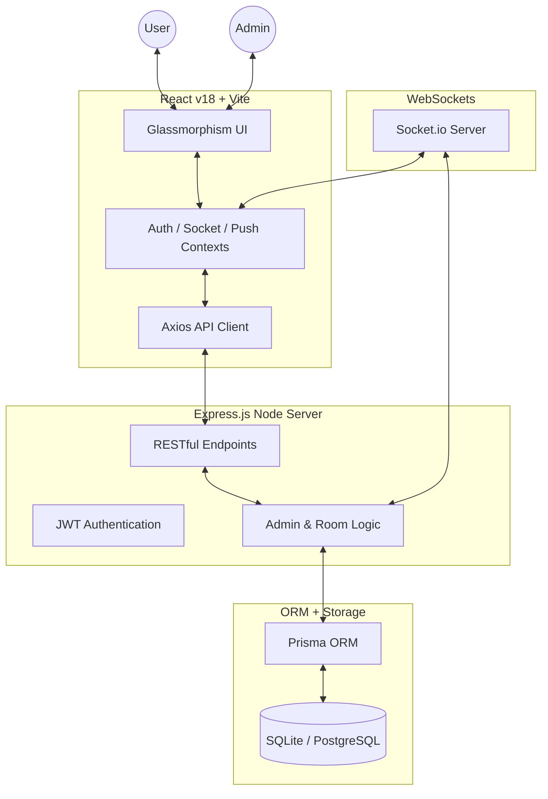

# RoommateConnect 🏠

RoommateConnect is a premium, real-time platform designed to bridge the gap between people offering rooms and those seeking them. Built with a focus on trust, aesthetics, and lightning-fast communication.


## 🚀 Core Features

- **Dual-Mode Listings**: Switch between "Offering a Room" (Owners) and "Seeking a Room" (Renters).
- **Real-Time Chat**: Direct, instant messaging with image sharing and "View Once" media.
- **Smart Filters**: Advanced location-based search (States/Cities) and price range filtering.
- **Push Notifications**: Never miss a match or message with browser-level push alerts.
- **Admin Command Center**: Complete oversight with real-time banning, broadcast alerts, and activity analytics.
- **Premium UX**: Glassmorphism UI, Skeleton screens for smooth loading, and responsive design for all devices.

---

## 🏗️ Technical Architecture



---

## 🛠️ Tech Stack

- **Frontend**: React, Vite, Lucide Icons, Recharts, React Hot Toast.
- **Backend**: Node.js, Express, Socket.io.
- **Database**: Prisma ORM, SQLite (Development), PostgreSQL (Production ready).
- **Communication**: WebSockets (Real-time), Web Push API.

---

## ⚡ Quick Start

### Prerequisites
- Node.js (v18+)
- npm or yarn

### 1. Clone the repository
```bash
git clone https://github.com/yourusername/roommate-connect.git
cd roommate-connect
```

### 2. Setup Server
```bash
cd server
npm install
# Setup environment variables in .env (copy from .env.example)
npx prisma generate
npx prisma db push
npm run dev
```

### 3. Setup Client
```bash
cd ../client
npm install
npm run dev
```

The app will be running at `http://localhost:5173`.

---

## 🛡️ Security & Performance
- **Password Hashing**: Bcryptjs for secure storage.
- **Authentication**: JWT (JSON Web Tokens) with 7-day expiration.
- **Data Integrity**: Enforced via Prisma relational constraints.
- **Optimization**: Modular CSS, Skeleton screens, and efficient re-renders.

---

## 📜 License
MIT License - Created for a superior roommate-finding experience.
